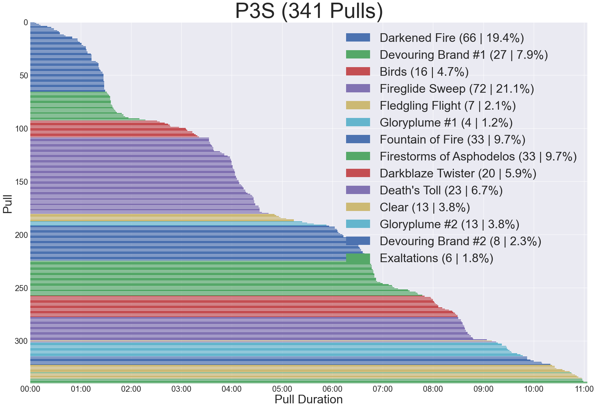

# ACT Log Parser

This a small script to parse the ACT logs for pulls relating to the first tier of Asphodelos savage raids in Final Fantasy XIV.  
Simply run the script to parse the data into pandas DataFrames.  
Many parsing mechanisms were derived from the logs themselves and the [quisquous's reference](https://github.com/quisquous/cactbot/blob/main/docs/LogGuide.md).

## Parse output

The parser will log instance starts, ends, wipes and clears.  
A summary will be output, similar to below.

```text
Asphodelos: The Fourth Circle (Savage) Part 1
instances: 53
pulls: 328
wipes: 301
clears: 28
deaths: 2958

     Instance  Clear           Start Time             End Time Duration  Deaths
0           3  False  2022-02-20 01:01:02  2022-02-20 01:02:22  0:01:20       8
144         3   True  2022-04-02 19:34:50  2022-04-02 19:42:07  0:07:17       2
151         3   True  2022-04-09 19:13:46  2022-04-09 19:21:01  0:07:15       1
196         3   True  2022-04-24 12:11:01  2022-04-24 12:18:11  0:07:10       3
197         3   True  2022-04-24 22:15:28  2022-04-24 22:22:46  0:07:18       2
212         3   True  2022-04-30 22:36:04  2022-04-30 22:43:21  0:07:17       3
241         3   True  2022-05-06 19:50:32  2022-05-06 19:57:33  0:07:01       2
246         3   True  2022-05-07 17:37:05  2022-05-07 17:44:14  0:07:09       4
252         3   True  2022-05-08 22:30:51  2022-05-08 22:38:01  0:07:10       4
256         3   True  2022-05-13 18:43:57  2022-05-13 18:51:08  0:07:11       4
257         3   True  2022-05-14 17:05:20  2022-05-14 17:12:21  0:07:01       0
261         3   True  2022-05-14 19:26:05  2022-05-14 19:33:06  0:07:01       0
273         3   True  2022-05-20 18:09:59  2022-05-20 18:17:00  0:07:01       1
279         3   True  2022-05-21 17:36:34  2022-05-21 17:43:44  0:07:10       2
281         3   True  2022-05-21 19:06:02  2022-05-21 19:13:12  0:07:10       4
283         3   True  2022-05-28 17:18:29  2022-05-28 17:25:21  0:06:52       2
284         3   True  2022-06-03 18:06:53  2022-06-03 18:13:45  0:06:52       2
286         3   True  2022-06-17 18:18:26  2022-06-17 18:25:04  0:06:38       2
289         3   True  2022-06-25 17:19:42  2022-06-25 17:26:52  0:07:10       4
305         3   True  2022-07-09 17:15:16  2022-07-09 17:22:17  0:07:01       4
306         3   True  2022-07-09 17:59:39  2022-07-09 18:06:40  0:07:01       5
310         3   True  2022-07-09 18:40:42  2022-07-09 18:47:33  0:06:51       5
316         3   True  2022-08-05 18:33:38  2022-08-05 18:40:30  0:06:52       0
318         3   True  2022-08-06 17:15:38  2022-08-06 17:22:54  0:07:16       6
320         3   True  2022-08-12 18:20:31  2022-08-12 18:27:48  0:07:17       2
325         3   True  2022-08-13 17:18:43  2022-08-13 17:25:52  0:07:09       4
326         3   True  2022-08-13 19:06:23  2022-08-13 19:13:13  0:06:50       2
327         3   True  2022-08-19 18:08:29  2022-08-19 18:15:29  0:07:00       1

Asphodelos: The Fourth Circle (Savage) Part 2
instances: 0
pulls: 324
wipes: 316
clears: 9
deaths: 2730

     Instance  Clear           Start Time             End Time Duration  Deaths
0           4  False  2022-04-02 19:42:43  2022-04-02 19:43:22  0:00:39       8
203         4   True  2022-05-21 20:07:16  2022-05-21 20:15:28  0:08:12       0
213         4   True  2022-05-28 18:22:04  2022-05-28 18:30:25  0:08:21       5
218         4   True  2022-06-03 18:39:07  2022-06-03 18:46:55  0:07:48       0
220         4   True  2022-06-17 18:28:39  2022-06-17 18:36:30  0:07:51       1
223         4   True  2022-06-25 17:33:21  2022-06-25 17:41:06  0:07:45       1
230         4   True  2022-07-09 18:09:53  2022-07-09 18:17:58  0:08:05       0
316         4   True  2022-08-13 19:43:17  2022-08-13 19:51:01  0:07:44       0
323         4   True  2022-08-19 18:47:05  2022-08-19 18:54:43  0:07:38       1
```

## Graph output

The parser will produce `deaths.csv` and `pulls.csv`, which can be used by the jupyter notebook.  
An example `pulls.csv` is committed for use.  
Walk through the code blocks to produce graphs.


